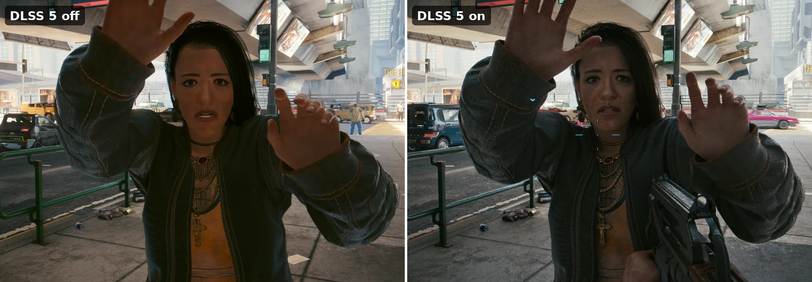
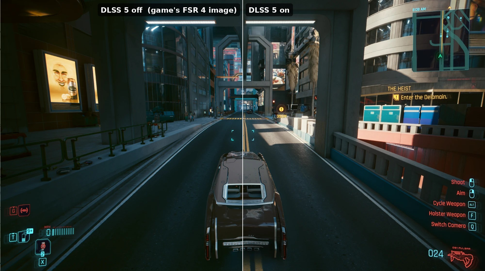

# NR-RedGreen


Run NVIDIA **DLSS 5 neural rendering** on a second, NVIDIA graphics card while the game itself renders on an
**AMD** card. Tested with Cyberpunk 2077 on an AMD Radeon AI PRO R9700 plus an RTX 5070.

The game runs on the AMD card and never sees the NVIDIA one. Every finished frame, with its motion vectors and
depth, is copied across PCIe to the RTX 5070. DLSS 5 runs there, and the 5070 shows the result on the monitor.

```
R9700: game renders (+ FSR) ──PCIe──► RTX 5070: DLSS 5 neural rendering ──► monitor
        motion vectors + depth taken from FSR mid-frame
```

NR-RedGreen is a fork of [MGPU Bridge](https://github.com/maohgad-web/Neural-coprocessor) by Marcelo Guibout,
which does this between two NVIDIA cards. NR-RedGreen makes it work with an AMD render card and adds a set of
performance, latency and reliability changes. (It started as nr-bridge, which is still the name inside the code, the
scripts and the `NRB` change tags.)



*The same character, DLSS 5 off and on (toggled with `Alt+F12`; the two shots were taken about a minute apart).*



*One frame, split down the middle by the bridge itself: the game's FSR 4 image on the left, DLSS 5 on the
RTX 5070 on the right.*

## Contents

- [Results](#results)
- [How it works](#how-it-works)
- [Requirements](#requirements)
- [Installation](#installation)
- [Configuration](#configuration)
- [Troubleshooting](#troubleshooting)
- [Known limitations](#known-limitations)
- [What NR-RedGreen changes](#what-nr-redgreen-changes)
- [Project layout and documentation](#project-layout-and-documentation)
- [Roadmap](#roadmap)
- [Credits](#credits)
- [Licence and disclaimer](#licence-and-disclaimer)

## Results

Cyberpunk 2077 at 2560x1440 with FSR 4 on the R9700 and DLSS 5 at full output resolution on the RTX 5070.
Medians over normal gameplay, from the bridge's own log.

| | First working version | Now |
|---|---|---|
| Frames on screen | ~62 fps | **~70 fps**, the same as the game renders |
| Hand-off latency¹ (median / slowest 10%) | 39 ms / not measured | **34 ms / 43 ms** |
| Inputs to DLSS 5 | colour only | colour + motion vectors + depth |
| Frame pacing | 3-frame jumps, dropped frames in menus | smooth, no dropped or out-of-order frames |
| DLSS 5 start-up | failed on about half of launches | starts every time |

¹ Time from the moment the AMD side hands a finished frame to the bridge until the 5070 picks it up for
DLSS 5. It does not include the DLSS 5 pass itself (about 13 ms) or the monitor, so it is not full
input-to-screen latency.

The limit now is DLSS 5 itself, about 13 ms per frame on the RTX 5070. Every test run and its numbers are in
[`docs/test-log.md`](docs/test-log.md).

## How it works

A ReShade add-on inside the game copies each finished frame into a ring of buffers that both cards can reach.
A shared fence tells the RTX 5070 when a frame has arrived, and the 5070 runs DLSS 5 on it and presents it.
Motion vectors and depth are copied out of AMD FSR's upscaler while the frame is being made, because DLSS 5
needs them and the game only produces them for FSR.

[`docs/how-it-works.md`](docs/how-it-works.md) explains every part in plain English, including the hardest bug.

## Requirements

**Hardware**
- An AMD Radeon card for the game (tested: Radeon AI PRO R9700) and an NVIDIA RTX card that supports DLSS 5
  neural rendering (tested: RTX 5070), both in the same PC.
- The monitor connected to the **NVIDIA** card.
- PCIe 4.0 x4 or better for each card. About 28 MB crosses the bus per frame at 1440p (roughly 2 GB/s at 70 fps).

**Software**
- 64-bit Windows with current drivers for both cards (tested: NVIDIA 617.14, AMD Adrenalin 32.0.31041).
- Cyberpunk 2077 on Steam (tested: game version 2.31), with **FSR 3.0 or FSR 4** selected as the upscaler in game.
- [ReShade](https://reshade.me) **with add-on support**, 6.8.0 or newer, installed into the game for DirectX 12.
- The DLSS 5 neural-rendering runtime, `nvngx_dlssnr.dll`. You must supply it yourself: it is not part of the
  NVIDIA driver, and this project does not distribute it. See [`vendor/README.md`](vendor/README.md).

**To build it yourself** (not needed with a release download)
- Visual Studio 2022 (or Build Tools) with the "Desktop development with C++" workload, which includes CMake
  and Ninja.
- Internet access the first time, to download the pinned NVIDIA NGX and ReShade headers.

## Installation

Run these in PowerShell from the project folder.

1. **Get the built add-on**, either way:
   - **Download** the latest zip from [Releases](https://github.com/MoHasan9505/nr-redgreen/releases) and extract
     it outside the game folder. It contains the add-on, sl-standin and the NVAPI gate already built. If Windows
     blocks the scripts because they were downloaded, run `Get-ChildItem -Recurse | Unblock-File` in the folder
     once.
   - **Or build it yourself** (needs Visual Studio, see [Requirements](#requirements)):
     ```powershell
     tools\fetch-deps.ps1     # once: NVIDIA NGX + ReShade headers into third_party\
     tools\build.ps1          # the add-on and every tool, into build\<name>\
     ```
2. **Supply the third-party files** listed in [`vendor/README.md`](vendor/README.md), in `vendor\nvidia\` and
   `vendor\rtinitfix\`.
3. **Install ReShade with add-on support** into Cyberpunk 2077 (`bin\x64\Cyberpunk2077.exe`, DirectX 12).
4. **Install it into the game** (quit the game first):
   ```powershell
   tools\deploy.ps1
   ```
   The scripts find the game in your Steam libraries. If yours is elsewhere, pass
   `-GameDir "D:\Games\Cyberpunk 2077"`, or set it once for every script with
   `setx NRB_GAME_DIR "D:\Games\Cyberpunk 2077"`.

   Deploy never deletes game files: anything it replaces is moved into `bin\x64\_nr-bridge-backup\`.
5. **Start the game**, and select FSR 3.0 or FSR 4 in the graphics settings:
   ```powershell
   tools\launch.ps1                   # through Steam
   tools\launch.ps1 -Watch myrun      # also copy ReShade.log into results\ when the game exits
   ```

To switch it off or remove it:

```powershell
tools\deploy.ps1 -Disable      # keep it installed, but ReShade stops loading the add-on
tools\deploy.ps1 -Enable
tools\deploy.ps1 -Uninstall    # remove everything and put the game's original files back
```

## Configuration

Settings live in `bin\x64\mgpu.ini` in the game folder. `deploy.ps1` writes the profile below each time it runs.
To compare a setting, edit `mgpu.ini` and restart the game; no rebuild is needed.

| Key | Deployed | Meaning |
|---|---|---|
| `MVec` | `3` | Real motion vectors, taken from FSR |
| `Depth` | `3` | Depth taken from FSR. `0` = colour only (a little faster, visibly worse picture) |
| `ProducerCopyQueue` | `1` | Do the PCIe copy on the AMD card's copy engine, so the game doesn't wait for it |
| `GpuPipeline` | `1` | Start the next DLSS 5 frame the moment the previous one finishes |
| `SignalAt` | `2` | Tell the 5070 a frame is ready right after the game presents it, one frame sooner |
| `AutoCap` | `1` | Pace the game just below the 5070's speed, so frames never queue up waiting for DLSS 5 |
| `PresentVsync` | `0` | No V-sync on the bridge's own output (it cost ~15 fps) |
| `DcompOverlay` | `1` | Single monitor: the DLSS 5 output is shown over the game's window |
| `Calib` | `0` | Off: there is no game-side DLSS to calibrate against |

Every other key is the original MGPU Bridge setting; see [`bridge/README.md`](bridge/README.md).

**Hotkeys** (they work with no menu open, so they stay out of screenshots):

| Keys | What it does |
|---|---|
| `Alt+F12` | DLSS 5 on/off, full screen: off shows the game's own frame, on shows DLSS 5 |
| `Alt+F7` | Cycle the view: DLSS 5 → the frame sent into DLSS 5 → split (input left, DLSS 5 right) |
| `Ctrl+Alt+Left` / `Right` | Move the split line; add `Shift` for bigger steps |

Opening the ReShade menu hides the DLSS 5 image (the menu is drawn by the game, underneath it); `Alt+F6` is the
same hide on a key. Both are unreliable on the development rig, so use `Alt+F12` for comparisons.
An fps counter is always shown at the top right of the DLSS 5 image: it counts frames actually presented to
the monitor. Steam's counter is drawn into the game's own frame, underneath the DLSS 5 image, so it is hidden.

Use a Windows screenshot (`Win+PrtScn` or the Snipping Tool). Steam's and ReShade's screenshot keys capture the
game's own frame, which is likely to miss the DLSS 5 image laid over it.

**Reading the log.** The add-on writes to `ReShade.log` in `bin\x64`, every line prefixed `[MGPU]`:
- `[MGPU][NRB13]` every 600 frames: frame time and fps on screen, DLSS 5 time (`EVALUATE`), copy time.
- `[MGPU][NRB17]`: what AutoCap is pacing the game to.
- `[MGPU][SEAL]`: a frame arrived late, out of order or damaged. A few in menus are normal; a steady stream is not.

## Troubleshooting

| Symptom | What to do |
|---|---|
| `Cyberpunk 2077 was not found in any Steam library` | Pass `-GameDir "<game folder>"` or set `NRB_GAME_DIR` (see [Installation](#installation)). |
| `deploy.ps1` reports `missing ...` | Run `tools\build.ps1`, and check the files in [`vendor/README.md`](vendor/README.md). |
| The game fails with "Ray Tracing initialization" | The game can see the NVIDIA card. Re-run `tools\deploy.ps1`, then check `bin\x64\sl-standin.log` for `PreloadNvapiGate: loaded the gate`; if it isn't there, set `MaskDXR=1` in `bin\x64\sl-standin.ini` to start the game without ray tracing. Background: [`docs/rt-init-error.md`](docs/rt-init-error.md). |
| The game runs, but the image is never DLSS 5 | Make sure FSR 3.0 or FSR 4 is selected in game: with any other upscaler the bridge waits for motion vectors that never come. Then check `ReShade.log` for `[MGPU]` errors. |
| `ERROR 204` or `ERROR 205` in the bridge window | ReShade could not compile the depth shader (check `EffectSearchPaths` in `ReShade.ini`), or `mgpu.ini` is missing (re-run deploy). |
| The DLSS 5 output never appears, and the log has a `[V49]` line naming the topmost composition slot | Another overlay holds that slot. Close the NVIDIA overlay (and other overlays) first. |
| Steady `[MGPU][SEAL]` errors during gameplay | Set `GpuPipeline=0` in `mgpu.ini` to check whether the pipeline is the cause, and open an issue with the log. |
| `FAIL_OutOfDate` at NGX Init | Shouldn't happen any more (NRB11). Open an issue with `ReShade.log`. |
| Anything else | `tools\deploy.ps1 -Disable` gets you back to the normal game straight away. |

## Known limitations

- **One game.** Only Cyberpunk 2077 is tested. The approach should suit other DirectX 12 games that use FSR,
  but the scripts and the FSR hooks would need checking for each one.
- **One machine.** Every result above comes from a single PC (see [`docs/test-system.md`](docs/test-system.md)).
- **FSR required.** Motion vectors and depth come from FSR 3.0 or FSR 4; other upscalers aren't supported.
- **Ray tracing costs game fps.** Ray tracing works (it runs on the AMD card), but it lowers the game's own frame
  rate as usual; see [`docs/rt-init-error.md`](docs/rt-init-error.md) for how it was made to work.
- **Windowed or borderless only.** Exclusive fullscreen can't work: the game renders on the AMD card while the
  monitor is on the NVIDIA one, and the DLSS 5 image is composed onto the game's window. In borderless mode
  Cyberpunk sizes its window to the game's resolution, not the monitor's, and the DLSS 5 image can only fill that
  window. To fill the screen, set **Windows' display resolution to the game's resolution** (tested: 2560x1600 on
  a 2880x1800 monitor, about 70 fps), or run the game at the monitor's native resolution (slower DLSS 5 pass).
  Restart the game after changing the window mode or resolution, so DLSS 5 starts at the new size.
- **Single monitor, on the NVIDIA card.** Not tested: HDR, multiple monitors, frame generation.
- **Latency.** The second card adds latency (34 ms median hand-off, plus the DLSS 5 pass). Fine for single
  player; not intended for competitive play.
- **DLSS 5 runtime.** `nvngx_dlssnr.dll` is not publicly distributed by NVIDIA, so you need your own copy.

## What NR-RedGreen changes

Every change is tagged `NRB<n>` in the code and recorded in [`docs/bridge-changes.md`](docs/bridge-changes.md)
with its reason and measurements.

**AMD render card + NVIDIA neural card** (the original needs two NVIDIA cards)
- `tools/sl-standin`: a replacement `sl.interposer.dll` that hides the NVIDIA card from the game, masks ray
  tracing support so the game starts on the AMD card, and keeps the game's swapchain visible to ReShade.
- `tools/nvapi-gate`: a stand-in `nvapi64.dll` that hides NVAPI from the game but not from the bridge.
- Finds GPUs that Windows hides from DXGI (NRB5) and ignores a duplicate listing of the 5070 (NRB8).
- Takes motion vectors (NRB9/10) and depth (NRB16) from AMD FSR's upscale pass instead of the game's DLSS.

**Bug fixes that also apply to the original**
- NRB11: DLSS failed to start on about half of all launches, at random, with `FAIL_OutOfDate`. The driver's
  `NVSDK_NGX_D3D12_Init` takes 4 arguments, and the bridge passed 5, so a memory address was read as the version.
- NRB12: the shutdown wait for the render card checked an object that had already been freed, so it never ran.
- NRB15: `SignalAt=1` could signal from the wrong card and, given ReShade's event order, gained nothing.

**Performance and latency**

| Change | Setting | Effect measured here |
|---|---|---|
| NRB12 | `ProducerCopyQueue=1` | PCIe copy on the AMD card's copy engine: game fps 64 → ~75 |
| NRB13 | always on | A timing line in the log every 600 frames |
| NRB14 | `GpuPipeline=1` | The 5070 no longer sits idle between frames: screen fps ~62 → 72-76 |
| NRB15 | `SignalAt=2` | Frames handed over one game frame sooner: hand-off latency ~45 → ~33 ms |
| NRB16 | `Depth=3` | Depth from FSR for DLSS 5: visibly better picture |
| NRB17 | `AutoCap=1` | Paces the game so frames never queue: hand-off latency back to ~34 ms with depth on |

## Project layout and documentation

| Path | What |
|---|---|
| `bridge/` | The ReShade add-on: the fork of MGPU Bridge (its own docs and licence are kept inside) |
| `tools/deploy.ps1`, `launch.ps1`, `watch-launch.ps1` | Install, start, and collect the logs of a run |
| `tools/game-dir.ps1` | Finds the game folder for the other scripts |
| `tools/build.ps1`, `fetch-deps.ps1` | Build everything; download the pinned NGX + ReShade headers |
| `tools/sl-standin/`, `tools/nvapi-gate/` | Stand-in DLLs that keep the NVIDIA card hidden from the game |
| `tools/nr-probe/`, `tools/xadapter-probe/` | Standalone tests: DLSS 5 on the NVIDIA card, and the GPU-to-GPU transport |
| `vendor/` | Third-party files you supply (git-ignored, never redistributed) |

| Document | Contents |
|---|---|
| [`docs/how-it-works.md`](docs/how-it-works.md) | Plain-English overview |
| [`docs/bridge-changes.md`](docs/bridge-changes.md) | Every change to the bridge (NRB1-NRB22) and why |
| [`docs/test-log.md`](docs/test-log.md) | Test runs 13-32: what was measured and what changed because of it |
| [`docs/measurements.md`](docs/measurements.md) | Probe measurements (DLSS 5 cost per resolution, PCIe transport) and project history |
| [`docs/test-system.md`](docs/test-system.md) | The PC, drivers and game version the results were measured on |
| [`docs/rt-init-error.md`](docs/rt-init-error.md) | Why Cyberpunk failed to start ray tracing with an NVIDIA card present, and how it was fixed |

## Roadmap

- Make the scripts and FSR hooks work with other DirectX 12 games that use FSR.
- HDR output.
- Frame generation on the NVIDIA card.

## Credits

- **[MGPU Bridge / Neural-coprocessor](https://github.com/maohgad-web/Neural-coprocessor)** by Marcelo Guibout
  (MIT): the bridge this project is built on, including the cross-GPU transport, the NGX integration and the
  ReShade add-on.
- **[ReShade](https://reshade.me)** by crosire; **NVIDIA DLSS / NGX**; **AMD FidelityFX FSR**; **RTInitFix**.
- NR-RedGreen was designed, tested and validated by **MoHasan9505** on their own hardware. The code for the changes
  was written with **Claude** (Anthropic), an AI assistant.

## Licence and disclaimer

MIT: see [`LICENSE`](LICENSE). The original MGPU Bridge licence is kept in [`bridge/LICENSE`](bridge/LICENSE).
Third-party files in `vendor/` are under their owners' terms and aren't included.

NR-RedGreen is an unofficial hobby project. It is not affiliated with or endorsed by NVIDIA, AMD,
CD PROJEKT RED or the MGPU Bridge project. It loads code into the game process: use it in single player only,
and at your own risk. The software is provided "as is", without warranty of any kind.
